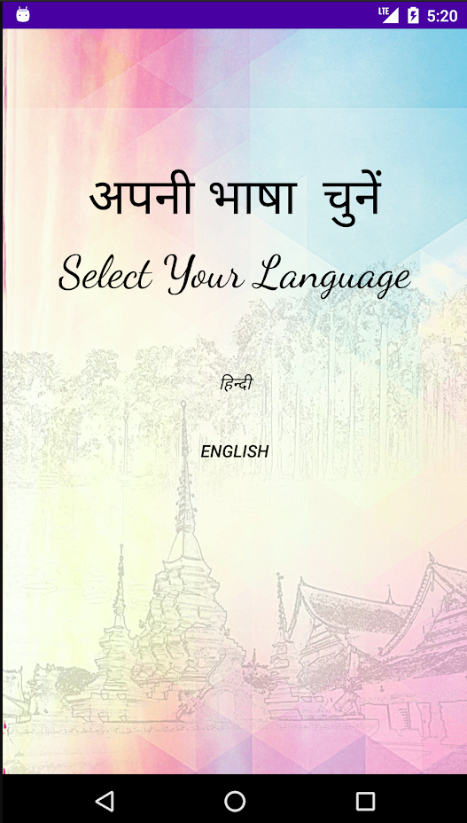
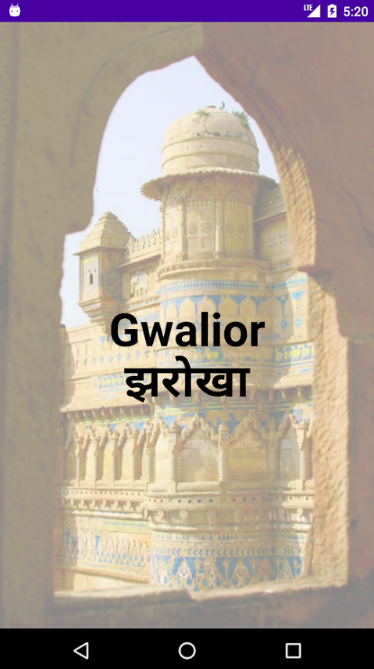
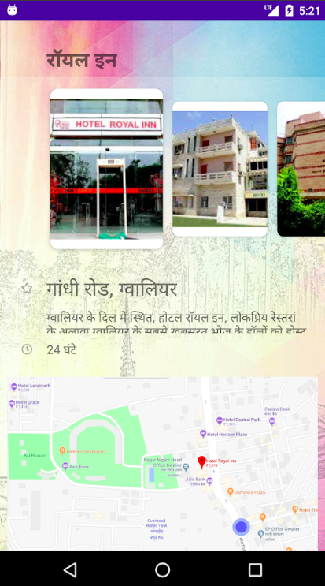
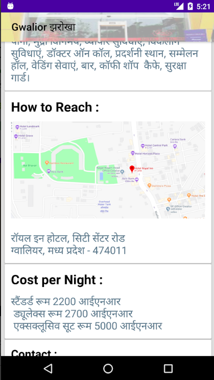

# Introduction

Gwalior Jharokha is an android application providing the detailed information about the best old and known Tourism sites of Gwalior that defines the city.Apart from the historical and worship these rich old places ar of cultural importance that define the taste of the city as a blend of maratha,mughal, and north indian culture.A must have app for any tourist visiting Gwalior.

* Challenge for open sourcers: MAKE THIS APP DYNAMIC FOR ALL CITIES.

# UI/UX
  |   |    |   

The application supports Android 4.4 KitKat (API level 19) and above.

Features include:

  * An easy-to-use interface.
  
  * Hindi and English UI.

  * **Nearby Hotels**: A List of all prominent and famous hotels of Gwalior.

  * **Places to Visit**: A tourist needs a list of all the needs for his wanderlust, we have it.

  * **SOS numbers**: Every traveller needs security. Gwalior Jharoka gives direct access to all major contacts needed in the city.

  * **Washroom facilites**: These serve not only for emergencies, but even when you end up satisfying your hunger in the city.

  * **Nearby Hospitals**: Gwalior Jharoka has the ability to lead you to your nearest hospital.

# Installation

There are different ways to get the Gwalior app for Android; through
the app store, from github or building it yourself.

## Building

### With Android Studio
The easiest way to build is to install [Android Studio](https://developer.android.com/sdk/index.html) v2.+
with [Gradle](https://www.gradle.org/) v3.4.1
Once installed, then you can import the project into Android Studio:

1. Open `File`
2. Import Project
3. Select `build.gradle` under the project directory
4. Click `OK`

Then, Gradle will do everything for you.

## Support

Email: tutushubham@gmail.com

## Contributing

There are several ways you could contribute to the development.

* Pull requests are always welcome! You could contribute code by fixing bugs, adding new features or automated tests. It is also preferable to target issues which you can find! 

* Another way to contribute is by providing translations for languages, or improving translations.

* PRs would be merged soon and feel free to treat this app as your playground.

For development, it is recommended to use the Android Studio for development which is available for free.
Import the project into the IDE using the build.gradle file. The IDE will resolve dependencies automatically.

# Licence
Gwalior Jharoka is free software; you can redistribute it and/or
modify it under the terms of the Apache license, version 2.0.
You may obtain a copy of the License at

       http://www.apache.org/licenses/LICENSE-2.0

Unless required by applicable law or agreed to in writing, software
distributed under the License is distributed on an "AS IS" BASIS,
WITHOUT WARRANTIES OR CONDITIONS OF ANY KIND, either express or implied.
See the License for the specific language governing permissions and
limitations under the License.
